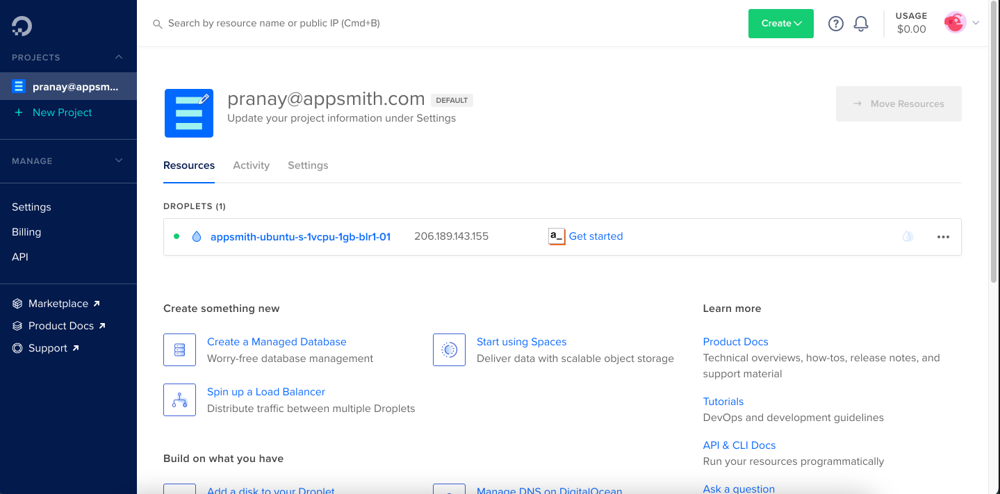

# DigitalOcean



You can deploy Appsmith on DigitalOcean using the Appsmith droplet from Digital Ocean’s 1-Click Apps Marketplace and host it on our custom domain.

Login to your DigitalOcean account to get started. If you are a new user, use this[ link](https://marketplace.digitalocean.com/apps/appsmith?refcode=469c9f1431e4) and get a $25 credit on DigitalOcean!

## Deploying Appsmith on DigitalOcean

Once logged in, follow the steps listed below:

* Find Appsmith from the DigitalOcean marketplace [here](https://marketplace.digitalocean.com/apps/appsmith).
* Click on the Create Appsmith Droplet button; this will redirect you to a new page where you can set up all your configurations.


For a base configuration, use the following settings.

```bash
Shared CPU: Basic
CPU Options: Regular Intel with SSD (1 GB CPU / 25GB SSD / 1000GB Transfer )
Data Center Region: (Choose the nearest location to your place)
Additional Options: IPV6 Enabled
```


* In the authentication section, you can either choose SSH or set up a password if you want to log in to your server.
* Lastly, click on the Create Droplet button.


It will take a few minutes \(approximately 3-4 minutes\) to install Appsmith on the DigitalOcean droplet. You’ll find the deployed droplet on your dashboard with all the details of the selected configuration.



To use Appsmith, copy the IPv4 address from the settings and open it in a new tab. This will take you to Appsmith’s login page. Since this is a new instance, click on sign up to create a new account on Appsmith.


## Updating to latest Appsmith release
SSH into your droplet and run the following command:
```
cd appsmith && docker-compose pull && docker-compose rm -fsv appsmith && docker-compose up -d
```

## Troubleshooting

If you encounter any errors during this process, check out our guide on [debugging deployment errors](../troubleshooting-guide/deployment-errors.md), if you are still facing an issue please reach out to [support@appsmith.com](mailto:support@appsmith.com) or join our [Discord Server](https://discord.com/invite/rBTTVJp) to directly speak to the appsmith team!

## Further Reading

* [Configuring Self Hosted Instances](instance-configuration/#configuring-docker-installations)
* [Managing the Appsmith instance](instance-management.md)
* [Tutorials](../tutorials/)

